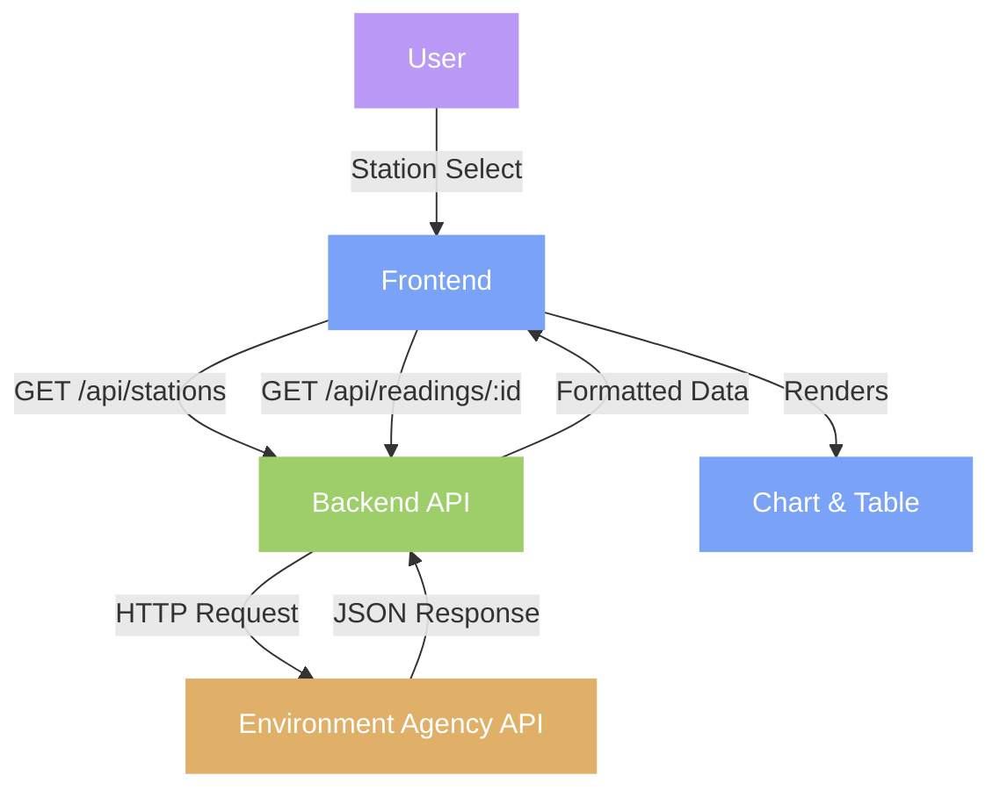

# Flood Monitoring System: FloodWatch

## Key Functionality
- **Real-time Data Visualization**: Displays water level readings from flood monitoring stations across the UK.
- **Station Selection**: Interactive dropdown menu to select from hundreds of active monitoring stations.
- **Historical Data**: Charts water level readings over the past 24 hours with precise time stamps.
- **Detailed Table View**: Presents readings with 4 decimal place precision alongside the chart.
- **Responsive Design**: Adapts to different screen sizes while maintaining visualization quality.
- **Error Handling**: Comprehensive error handling with user-friendly feedback.
- **API Integration**: Connects with the Environment Agency's flood monitoring API to fetch live data.

## Technology Stack and Setup

**Backend**  
FastAPI (with Uvicorn) | Python 3.9+ | Async HTTP Requests | Pytest

**Frontend**  
Chart.js | JavaScript | CSS3 | HTML5

Starting the uvicorn server: 
```console
uvicorn main:app --reload
```

## Frontend View

The interface features three main components:
1. **Station Selection Header**: Clean dropdown menu for selecting monitoring stations.


2. **Water Level Chart**: Visual representation of water levels over time.


3. **Readings Table**: Tabular data showing exact readings with timestamps.


## Core Workflow using Async API Calls

1. **get_stations()**
   - Fetches active monitoring stations from the Environment Agency API.
   - Filters and processes station data for display.

2. **get_readings(station_id)**
   - Retrieves 24-hour water level readings for the selected station.
   - Processes raw data to extract timestamps, values, and units.

3. **Visualization Logic**
   - Chart.js renders time-series data with responsive design.
   - Table component displays precise values (4 decimal places).

4. **Error Handling**
   - Manages API failures, invalid station IDs, and network issues.
   - Provides user-friendly error messages.




## Testing

The application includes a test suite with:
- **Unit tests**: Testing individual API endpoints
- **Error handling tests**: Ensuring error management

Run tests with:
```console
pytest
```
